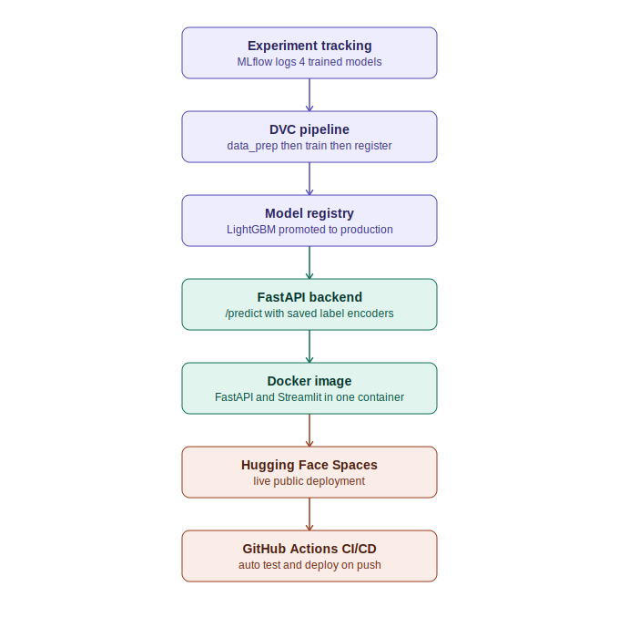

# U.S. Accident Severity Prediction Using Machine Learning

**[Live Demo: Try the deployed model here](https://huggingface.co/spaces/Nazishatta/accident-severity-mlops)**


An end-to-end machine learning study for predicting the severity of traffic accidents in the United States using historical accident, weather, location, road-infrastructure, and time-based features.

> **Project status:** Research and academic prototype  
> **Course:** DATS 6202-10 - Machine Learning I, Spring 2026  
> **Institution:** George Washington University

---


## Production MLOps Deployment

This research project has since been extended into a fully deployed, production-style MLOps
pipeline, built independently by Nazish Atta as a solo follow-on project. The original modeling work above (Logistic Regression, Random Forest, LightGBM, MLP comparison) was a team effort; the MLOps pipeline, deployment, and automation described below were designed and built independently.

**[Live Demo: Try the model here](https://huggingface.co/spaces/Nazishatta/accident-severity-mlops)**

### Deployment Architecture



**What was added:**
- MLflow experiment tracking and model registry (LightGBM promoted to production)
- FastAPI backend serving real-time predictions with persisted label encoders
- Streamlit frontend for non-technical users
- Dockerized deployment (FastAPI + Streamlit in a single container)
- Live public deployment on Hugging Face Spaces
- GitHub Actions CI/CD pipeline for automatic testing and deployment

See the src/ folder and app/ folder for implementation details.

---
## Table of Contents

- [Project Overview](#project-overview)
- [Problem Statement](#problem-statement)
- [Project Objectives](#project-objectives)
- [Dataset](#dataset)
- [End-to-End Workflow](#end-to-end-workflow)
- [Data Preparation](#data-preparation)
- [Feature Engineering](#feature-engineering)
- [Exploratory Data Analysis](#exploratory-data-analysis)
- [Modeling Strategy](#modeling-strategy)
- [Evaluation Metrics](#evaluation-metrics)
- [Results](#results)
- [Key Findings](#key-findings)
- [Repository Structure](#repository-structure)
- [Technology Stack](#technology-stack)
- [How to Run the Project](#how-to-run-the-project)
- [Reproducibility Notes](#reproducibility-notes)
- [Limitations](#limitations)
- [Responsible Use](#responsible-use)
- [Future Improvements](#future-improvements)
- [Team](#team)
- [Acknowledgments](#acknowledgments)

---

## Project Overview

Traffic accidents create significant public-safety, mobility, and economic challenges. Understanding the conditions associated with accident severity can support research into safer roads, more informed transportation planning, and better allocation of emergency-response resources.

This project builds and evaluates multiclass machine learning models that predict accident severity levels from historical U.S. accident records. The notebook covers the complete analytical workflow:

- Downloading and loading a large public dataset
- Memory-aware data processing
- Data-quality assessment
- Missing-value treatment and outlier handling
- Time-based feature engineering
- Exploratory data analysis
- Class-imbalance mitigation
- Model training and hyperparameter search
- Per-class and overall evaluation
- Feature-importance analysis
- Final model comparison

The final comparison includes Logistic Regression, Random Forest, LightGBM, and a Multi-Layer Perceptron neural network.

---

## Problem Statement

Given the recorded conditions of a traffic accident—including location, time, weather, road characteristics, and related contextual variables—predict its reported severity class.

The target variable contains four severity levels:

| Severity | Interpretation |
|---|---|
| 1 | Lowest reported impact |
| 2 | Moderate reported impact |
| 3 | High reported impact |
| 4 | Highest reported impact |

The classification problem is challenging because the target distribution is strongly imbalanced. Severity 2 represents most observations, while Severities 1 and 4 are comparatively rare.

---

## Project Objectives

The project is designed to:

1. Build a reliable processing workflow for a multi-million-row traffic dataset.
2. identify missing values, invalid timestamps, duplicate records, and unrealistic numeric values.
3. Engineer useful temporal and behavioral features from accident timestamps.
4. Explore geographic, temporal, weather, and road-related accident patterns.
5. Compare linear, tree-based, gradient-boosting, and neural-network classifiers.
6. Address class imbalance through class weighting and upsampling.
7. Evaluate both overall and per-severity performance.
8. Identify the strongest model and discuss the trade-off between predictive performance and training cost.
9. Document limitations that must be addressed before any operational use.

---

## Dataset

The project uses the **U.S. Accidents** dataset published on Kaggle by Sobhan Moosavi.

- **Dataset page:** [U.S. Accidents on Kaggle](https://www.kaggle.com/datasets/sobhanmoosavi/us-accidents)
- **Time coverage:** 2016–2023
- **Raw observations:** 7,728,394
- **Raw columns:** 46
- **Target:** `Severity`
- **Notebook download method:** `kagglehub`

The source data includes:

- Accident timestamps
- Start and end coordinates
- Distance affected
- State, city, county, and road information
- Temperature, humidity, pressure, visibility, precipitation, and wind
- Weather conditions
- Road and infrastructure indicators
- Daylight and twilight conditions
- Severity class

The raw dataset is not stored in this repository because of its size. The notebook downloads it programmatically.

### Initial Severity Distribution

| Severity | Records | Share |
|---:|---:|---:|
| 1 | 67,366 | 0.87% |
| 2 | 6,156,981 | 79.67% |
| 3 | 1,299,337 | 16.81% |
| 4 | 204,710 | 2.65% |

This distribution confirms that weighted metrics alone are not sufficient; per-class results must also be reviewed.

---

## End-to-End Workflow

```text
Kaggle U.S. Accidents Dataset
            |
            v
Chunked CSV Loading and Memory Optimization
            |
            v
Data Profiling and Quality Assessment
            |
            v
Column Removal, Outlier Treatment, and Imputation
            |
            v
Invalid Timestamp Removal
            |
            v
Parquet-Based Intermediate Storage
            |
            v
Temporal and Behavioral Feature Engineering
            |
            v
Exploratory Data Analysis
            |
            v
Feature Selection and Categorical Encoding
            |
            v
Stratified Sampling and Train/Test Splitting
            |
            v
Model Training and Hyperparameter Search
            |
            v
Classification Reports and Confusion Matrices
            |
            v
Model Comparison and Feature Importance
```

---

## Data Preparation

### Memory-Aware Loading

The source CSV is loaded in chunks of 500,000 rows. Numeric columns are downcast where possible, and low-cardinality text columns are converted to categorical data types.

The raw in-memory dataset contained:

- **7,728,394 rows**
- **46 columns**
- Approximately **7.3 GB** of measured deep memory usage after the initial load

### Data-Quality Review

The notebook evaluates:

- Data types
- Missing-value counts and percentages
- Fully duplicated rows
- Duplicate accident IDs
- Severity distribution
- Numeric summary statistics
- High-frequency categorical values
- Accident date range

No fully duplicated rows or duplicated IDs were found.

### Cleaning Decisions

The following columns are removed:

- `Country` — single-value field
- `End_Lat` and `End_Lng` — approximately 44% missing
- `Wind_Chill(F)` — high missingness and overlap with temperature
- `Description` — unstructured text not modeled in this version
- `Turning_Loop` — no useful variation

The workflow also:

- Replaces implausible temperature, wind-speed, visibility, and pressure values with missing values
- Fills missing precipitation with zero
- Uses median imputation for remaining numeric fields
- Uses `Unknown` for missing categorical values
- Converts boolean values to compact integer indicators
- Converts accident timestamps into datetime values
- Removes records with invalid start or end timestamps

After invalid timestamps are removed, the cleaned dataset contains:

- **6,985,228 rows**
- **40 columns**
- No remaining missing values

Intermediate datasets are saved in Parquet format to reduce repeated CSV processing.

---

## Feature Engineering

The notebook creates time-based, behavioral, seasonal, duration, and cyclical features.

### Calendar Features

- Start year
- Start month
- Start day
- Start hour
- Start minute
- Day of week
- Quarter
- ISO week of year

### Behavioral Time Features

- Weekend indicator
- Part of day
- Morning rush-hour indicator
- Evening rush-hour indicator
- General rush-hour indicator
- Night indicator
- Business-hours indicator

### Seasonal Feature

- Winter
- Spring
- Summer
- Fall

### Duration Feature

Accident duration is calculated in minutes from `Start_Time` and `End_Time`.

Negative durations are treated as invalid. Records above the 99th percentile are removed to limit extreme duration values.

- **99th-percentile threshold:** approximately 779.9 minutes
- **Feature-engineered dataset:** 6,915,377 rows and 63 columns

### Cyclical Encodings

Sine and cosine transformations are applied to:

- Hour of day
- Day of week
- Month of year

These transformations allow models to represent the cyclical relationship between values such as hour 23 and hour 0.

---

## Exploratory Data Analysis

The notebook examines:

- Severity counts and percentages
- Accident frequency by year and month
- Hourly, weekday, and part-of-day patterns
- Average severity across time features
- States and cities with the highest accident counts
- Weather-variable distributions
- Numeric correlations
- Accident-duration distribution
- Road-feature relationships with severity

### Observed Patterns

The notebook reports the following descriptive patterns:

- Severity 2 dominates the dataset.
- Accident counts increased from 2016 through 2021 and declined in later years.
- Morning and late-afternoon rush periods show high accident activity.
- Weekdays contain more recorded accidents than weekends.
- California, Florida, and Texas have the largest accident counts in the dataset.
- Houston, Miami, and Los Angeles appear among the major city-level hotspots.
- Accident duration is strongly right-skewed.
- Junctions, railways, and traffic signals are associated with higher average recorded severity in the descriptive analysis.

These observations are associations in the historical data and should not be interpreted as proof of causation.

---

## Modeling Strategy

After cleaning and feature engineering, the notebook removes identifiers, raw timestamps, high-cardinality location fields, and selected redundant columns.

Categorical variables are transformed with `LabelEncoder`. The final model matrix contains **43 features**.

Two stratified samples are used:

- **100,000 records** for Logistic Regression, Random Forest, and MLP experiments
- **500,000 records** for LightGBM

Each sample is split into training and test sets using an 80/20 stratified split with `random_state=42`.

### Models

#### Logistic Regression

- Balanced class weights
- Three-fold grid search
- Standardized features
- Best parameters:
  - `C=1`
  - `solver='lbfgs'`
  - `max_iter=500`

#### Random Forest

- Balanced class weights
- Three-fold grid search
- Best parameters:
  - `n_estimators=200`
  - `max_depth=15`

#### LightGBM

- Balanced class weights
- Two-fold grid search
- Fixed:
  - `n_estimators=200`
  - `max_depth=6`
- Best parameters:
  - `learning_rate=0.1`
  - `num_leaves=63`

#### Multi-Layer Perceptron

- Minority-class upsampling
- Standardized input features
- Two hidden layers: `(128, 64)`
- ReLU activation
- Early stopping
- Maximum of 30 iterations

---

## Evaluation Metrics

The project evaluates each model using:

- Weighted F1-score
- Per-class precision
- Per-class recall
- Per-class F1-score
- Accuracy
- Confusion matrix
- Training time

The weighted F1-score is used for the primary ranking because it accounts for class support. However, the per-class metrics are essential because a strong weighted score can hide weak performance on rare severity classes.

---

## Results

### Overall Model Comparison

| Model | Weighted F1 | Training Time | Modeling Sample |
|---|---:|---:|---:|
| Logistic Regression | 0.5192 | 8.4 s | 100,000 |
| Random Forest | 0.7589 | 217.6 s | 100,000 |
| **LightGBM** | **0.7595** | 646.3 s | 500,000 |
| MLP Neural Network | 0.7429 | 108.9 s | 100,000 |

### Per-Class F1 Comparison

| Model | Severity 1 | Severity 2 | Severity 3 | Severity 4 |
|---|---:|---:|---:|---:|
| Logistic Regression | 0.1179 | 0.5358 | 0.5227 | 0.1485 |
| Random Forest | 0.4813 | **0.8209** | 0.5822 | **0.2882** |
| **LightGBM** | **0.4997** | 0.8082 | **0.6371** | 0.2868 |
| MLP Neural Network | 0.4311 | 0.8080 | 0.5646 | 0.2054 |

### Final Selection

LightGBM achieved the highest weighted F1-score:

```text
Best model: LightGBM
Weighted F1-score: 0.7595
```

Random Forest performed almost identically while using a smaller modeling sample and substantially less training time in this run. Therefore, LightGBM is the top-performing experimental model, while Random Forest provides a strong efficiency-performance alternative.

> Training-time comparisons should be interpreted carefully because LightGBM was trained on 500,000 sampled records, while the other models used 100,000.

---

## Key Findings

- Tree-based models substantially outperformed Logistic Regression.
- LightGBM produced the strongest overall weighted F1-score.
- Random Forest delivered nearly the same overall score with a shorter recorded training time.
- Severity 2 was the easiest class for all models to predict.
- Severity 4 remained difficult for every model.
- LightGBM improved the F1-score for Severities 1 and 3.
- Location, accident duration, distance, year, and weather variables appeared among the most important LightGBM features.
- Class imbalance remained the central modeling challenge.

---

## Repository Structure

```text
.
├── US_Accident_version4.ipynb   # Complete analysis and modeling notebook
└── README.md                    # Project overview, methodology, and results
```

The raw and processed datasets are intentionally excluded because of their size. They can be downloaded or regenerated through the notebook.

A future modular version may separate reusable code, reports, model artifacts, and figures into dedicated folders.

---

## Technology Stack

- **Python**
- **Google Colab**
- **pandas**
- **NumPy**
- **Matplotlib**
- **Seaborn**
- **scikit-learn**
- **LightGBM**
- **KaggleHub**
- **Joblib**
- **PyArrow / Parquet**
- **Google Drive** for intermediate artifact storage

---

## How to Run the Project

### Recommended Environment

The notebook was designed for Google Colab and processes a very large dataset. A high-memory runtime is strongly recommended.

### Option 1: Google Colab

1. Upload `US_Accident_version4.ipynb` to Google Colab.
2. Select a high-memory runtime when available.
3. Run the notebook cell by cell.
4. Approve Google Drive access when prompted.
5. Allow `kagglehub` to download the dataset.
6. Run the data-preparation, analysis, and model-training sections in sequence.

The notebook saves these intermediate artifacts to Google Drive:

```text
df_raw.parquet
df_cleaned.parquet
df_features.parquet
lgbm_best.pkl
```

### Option 2: Local Jupyter Environment

Create and activate a virtual environment, then install the required packages.

```bash
python -m venv .venv
```

On Windows PowerShell:

```powershell
.\.venv\Scripts\Activate.ps1
```

On macOS or Linux:

```bash
source .venv/bin/activate
```

Install dependencies:

```bash
python -m pip install --upgrade pip
pip install pandas numpy matplotlib seaborn scikit-learn lightgbm kagglehub joblib pyarrow jupyter
```

Start Jupyter:

```bash
jupyter notebook
```

### Local-Execution Note

The current notebook contains Google Colab and Google Drive paths such as `/content/drive/MyDrive/`. These cells must be adapted before running locally.

---

## Reproducibility Notes

- Random sampling and splitting use `random_state=42`.
- Train/test splits are stratified by severity.
- Hyperparameter searches use weighted F1-score.
- Intermediate datasets are stored in Parquet format.
- The selected LightGBM model is saved with Joblib.
- The notebook is intended to be executed sequentially.
- Depending on runtime resources, a complete execution may take approximately 35–60 minutes or longer.
- Model timing results are environment-dependent and should not be treated as hardware-independent benchmarks.

---

## Limitations

This project is a research prototype and has several important limitations.

### Class Imbalance

Severity 2 accounts for nearly 80% of the source data. Weighted F1 therefore remains heavily influenced by the majority class. Rare-class precision and F1 are still limited.

### Different Modeling Sample Sizes

LightGBM uses a 500,000-record sample, while Logistic Regression, Random Forest, and MLP use 100,000 records. The comparison is useful but not a perfectly controlled benchmark.

### Random Rather Than Temporal Validation

The notebook uses random stratified train/test splits. A stronger real-world evaluation would train on earlier years and test on later years to measure temporal generalization and data drift.

### Post-Event Duration Feature

`duration_min` is calculated from the recorded end time. This information would not be available at the beginning of an accident. It may be appropriate for retrospective severity analysis, but it should be removed from any real-time or early-response prediction system to prevent information leakage.

### Categorical Encoding

Label encoding assigns integer values to categories. For nominal variables, this can introduce artificial ordering. Future experiments should compare one-hot, target, frequency, or native categorical encoding.

### Geographic Generalization

Exact coordinates and location-related fields can capture historical regional patterns. Performance may decline in locations or periods that differ from the training data.

### Limited Hyperparameter Search

The search spaces were intentionally restricted to manage computational cost. The reported results are not guaranteed to be globally optimal.

### No Probability Calibration

The study compares predicted classes, but it does not evaluate whether predicted probabilities are well calibrated.

### Operational Validation

The models have not been validated in a live transportation, emergency-management, or public-safety environment.

---

## Responsible Use

This repository is intended for education, research, and exploratory transportation analytics.

It must not be used as the sole basis for:

- Emergency dispatch decisions
- Medical or life-safety decisions
- Law-enforcement actions
- Insurance eligibility or pricing
- Legal conclusions
- Automated allocation of public-safety resources

Historical traffic data may contain geographic, reporting, and coverage biases. Model outputs should be reviewed by qualified domain experts and combined with current operational information.

The project predicts patterns in historical records; it does not establish causal relationships or guarantee the severity of future accidents.

---

## Future Improvements

- Use a time-based train/validation/test split.
- Remove post-event features for real-time prediction experiments.
- Compare one-hot, frequency, and native categorical encoding.
- Evaluate CatBoost and XGBoost.
- Expand hyperparameter optimization.
- Add macro F1, balanced accuracy, Matthews correlation coefficient, and precision-recall curves.
- Tune decision thresholds for rare classes.
- Compare class weighting with SMOTE or other resampling strategies.
- Add probability calibration and uncertainty analysis.
- Evaluate performance by state, year, weather condition, and urban/rural region.
- Add drift and fairness assessments.
- Build reusable preprocessing and inference pipelines.
- Save preprocessing encoders together with the final model.
- Add automated tests and a reproducible dependency file.
- Create an interactive analysis dashboard only after the modeling pipeline is modularized and validated.

---

## Team

- Ilgaz Kusku
- Nazish Atta
- Alejandro Gomez

**Instructor:** Yuxiao (James) Huang  
**Course:** DATS 6202-10 — Machine Learning I, Spring 2026  
**Institution:** George Washington University

---

## Acknowledgments

The project uses the public U.S. Accidents dataset distributed through Kaggle. Credit belongs to the dataset creators and maintainers.

Before redistributing any data, review the dataset page for its current terms, citation guidance, and usage conditions.

---

## Disclaimer

The results in this repository reflect one experimental workflow, selected samples, defined preprocessing decisions, and a specific runtime environment. They should not be interpreted as a production-ready traffic-severity forecasting system or as evidence that the identified variables cause accident severity.
